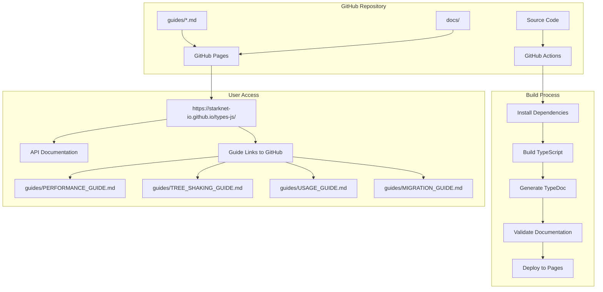

# 🚀 GitHub Pages Deployment Guide

## 📋 Complete Setup Instructions

### 1. 🔧 Initial Repository Configuration

#### Enable GitHub Pages via Web Interface:
```bash
# 1. Go to repository settings
open "https://github.com/starknet-io/types-js/settings/pages"

# 2. Configure source:
#    - Source: "Deploy from a branch"
#    - Branch: "main"
#    - Folder: "/docs"
#    - Click "Save"
```

#### Or Enable via GitHub CLI:
```bash
# Enable GitHub Pages programmatically
gh api --method POST -H "Accept: application/vnd.github+json" \
  "/repos/starknet-io/types-js/pages" \
  -f source='{"branch":"main","path":"/docs"}'
```

### 2. 🏗️ Build and Deploy Documentation

#### Option A: Automated Deployment (Recommended)
```bash
# The GitHub Actions workflow will automatically deploy on push to main
git add .
git commit -m "docs: setup GitHub Pages deployment"
git push origin main

# Monitor deployment
gh workflow run docs.yml
gh run list --workflow=docs.yml
```

#### Option B: Manual Deployment Script
```bash
# Use the provided deployment script
./deploy-docs.sh --setup      # Initial setup
./deploy-docs.sh              # Deploy documentation
./deploy-docs.sh --status     # Check deployment status
```

#### Option C: Manual Steps
```bash
# 1. Generate documentation
npm run docs:generate

# 2. Commit and push docs
git add docs/
git commit -m "docs: deploy TypeDoc documentation"
git push origin main
```

### 3. 🔍 Verify Deployment

#### Check GitHub Pages Status:
```bash
# Via GitHub CLI
gh api repos/starknet-io/types-js/pages

# Via deployment script
./deploy-docs.sh --status

# Manual check
curl -I https://starknet-io.github.io/types-js/
```

## 📊 Deployment Architecture



## 🔧 Configuration Files

### GitHub Actions Workflows:
- `.github/workflows/docs.yml` - Automatic deployment on push
- `.github/workflows/docs-manual.yml` - Manual deployment workflow

### Documentation Configuration:
- `typedoc.json` - TypeDoc configuration with guide links
- `tsconfig.docs.json` - TypeScript config for documentation
- `docs-theme.css` - Custom styling

### GitHub Pages Files:
- `docs/.nojekyll` - Disable Jekyll processing
- `docs/404.html` - Custom error page
- `docs/robots.txt` - Search engine instructions
- `docs/CNAME` - Custom domain configuration (optional)

## 🚀 Deployment Options

### 1. Automatic Deployment (Default)
- **Trigger**: Push to `main` branch
- **Files**: Any changes to `src/`, `guides/`, `typedoc.json`, etc.
- **Duration**: ~5-10 minutes
- **URL**: https://starknet-io.github.io/types-js/

### 2. Manual Deployment
```bash
# Trigger manual deployment
gh workflow run docs-manual.yml \
  --field environment=production \
  --field force_rebuild=true \
  --field include_dev_guides=true
```

### 3. Preview Mode
```bash
# Local preview before deployment
./deploy-docs.sh --preview
# Opens http://localhost:3000
```

## 📋 Post-Deployment Checklist

### ✅ Validation Steps:
1. **Site Accessibility**: https://starknet-io.github.io/types-js/
2. **API Documentation**: Functions, types, interfaces loaded
3. **Guide Links**: Sidebar links to GitHub guides work
4. **Search Functionality**: TypeDoc search works
5. **Mobile Responsiveness**: Site works on mobile
6. **Performance**: Page load time < 3 seconds

### 🔗 Quick Links After Deployment:
- 🏠 **Main Documentation**: https://starknet-io.github.io/types-js/
- 📋 **Developer Guides**: https://github.com/starknet-io/types-js/tree/main/guides
- 📊 **Performance Guide**: https://github.com/starknet-io/types-js/blob/main/guides/PERFORMANCE_GUIDE.md
- 🌳 **Tree Shaking Guide**: https://github.com/starknet-io/types-js/blob/main/guides/TREE_SHAKING_GUIDE.md

## 🛠️ Troubleshooting

### Common Issues:

#### 1. Documentation not updating
```bash
# Check workflow status
gh run list --workflow=docs.yml

# Force rebuild
gh workflow run docs-manual.yml --field force_rebuild=true

# Check for build errors
npm run docs:generate
```

#### 2. Guide links not working
- Verify `typedoc.json` has correct `sidebarLinks`
- Check guides exist in repository
- Ensure GitHub repository is public

#### 3. 404 errors
- Wait 5-10 minutes after deployment
- Check GitHub Pages settings
- Verify docs folder has index.html

#### 4. Styling issues
- Check `docs-theme.css` exists
- Verify `customCss` in `typedoc.json`
- Clear browser cache

### Debug Commands:
```bash
# Check GitHub Pages status
gh api repos/starknet-io/types-js/pages

# View deployment logs
gh run view --log

# Test local build
npm run docs:generate && npm run docs:serve

# Validate HTML
tidy -e docs/index.html
```

## 🔒 Security Considerations

### Permissions:
- Repository must be public for GitHub Pages
- Workflow permissions restricted to minimum required
- No secrets needed for documentation deployment

### Content Security:
- Documentation contains only public API information
- No sensitive data in generated docs
- Guide links point to public GitHub content

## 📈 Monitoring & Analytics

### GitHub Actions Monitoring:
```bash
# Recent deployments
gh run list --workflow=docs.yml --limit=10

# Deployment status
gh api repos/starknet-io/types-js/pages

# Site health check
curl -f https://starknet-io.github.io/types-js/
```

### Usage Analytics (Optional):
- Add Google Analytics to TypeDoc theme
- Monitor GitHub Pages traffic in repository insights
- Track guide clicks via GitHub repository insights

## 🔄 Maintenance

### Regular Tasks:
- **Weekly**: Check deployment status
- **Monthly**: Review and update guides
- **Quarterly**: Update GitHub Actions versions
- **As needed**: Regenerate documentation for major releases

### Update Procedures:
```bash
# Update documentation
git checkout main
git pull origin main
npm run docs:generate
git add docs/
git commit -m "docs: update documentation"
git push origin main
```

---

## 🎯 Summary

Your documentation is now configured for GitHub Pages with:

✅ **Automatic deployment** on every push to main  
✅ **TypeDoc integration** with comprehensive API docs  
✅ **Guide integration** via sidebar links to GitHub  
✅ **Custom styling** and responsive design  
✅ **Search functionality** built into TypeDoc  
✅ **Error handling** with custom 404 page  
✅ **Manual deployment** options available  

**Live URL**: https://starknet-io.github.io/types-js/

The documentation will automatically update whenever you push changes to the main branch!